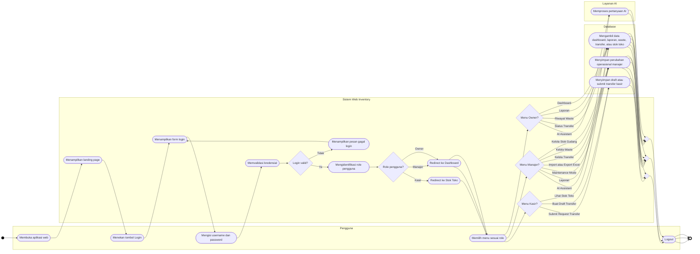
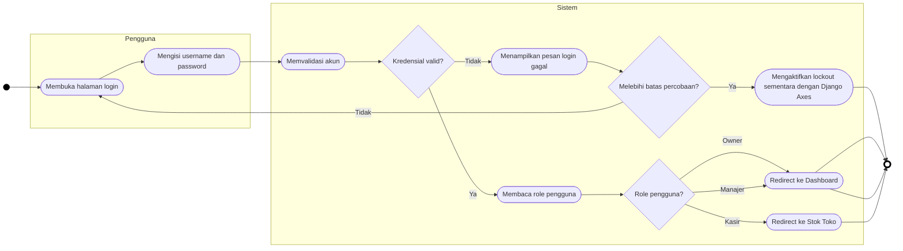
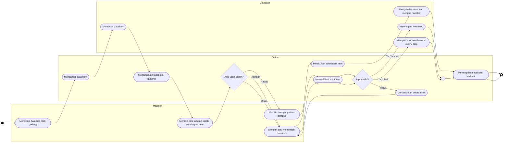
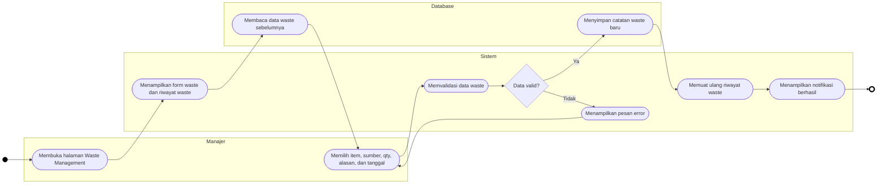
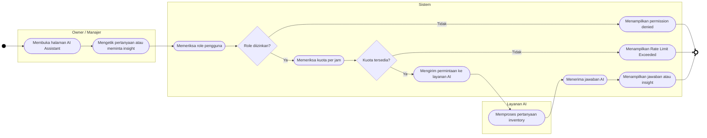
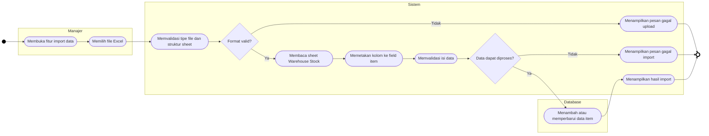
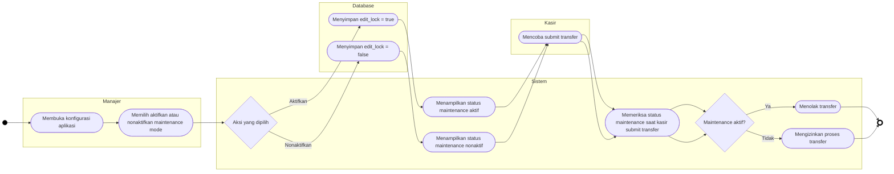

# Activity Diagram Mermaid

Dokumen ini berisi activity diagram versi Mermaid yang dibuat lebih dekat ke standar UML Activity Diagram untuk kebutuhan skripsi mahasiswa.

Catatan penting:
- Mermaid tidak mendukung notasi UML Activity secara 100% penuh seperti tool UML khusus.
- Untuk mendekati standar UML, diagram di bawah memakai:
  - `subgraph` sebagai swimlane/partisi aktor
  - node berbentuk rounded/stadium untuk action
  - diamond untuk decision dan merge
  - node awal dan akhir yang distyling menyerupai initial/final node
- Alur sudah disesuaikan dengan implementasi project saat ini, bukan fitur di luar cakupan skripsi.

Prinsip sistem:
- Owner hanya read-only pengawasan.
- Manajer memegang fungsi operasional penuh.
- Kasir hanya mengakses stok toko dan transfer request.
- Kelola akun pengguna tidak dimasukkan sebagai use case operasional.
- Django Admin tidak dimasukkan ke activity diagram utama karena dianggap alat konfigurasi/deployment.

## 1. Activity Diagram Utama Sistem

## 2. Activity Diagram Login dan RBAC

## 3. Activity Diagram Kelola Stok Gudang

## 4. Activity Diagram Waste Management

## 5. Activity Diagram Transfer Barang

```mermaid
flowchart LR
    classDef initial fill:#000,stroke:#000,color:#000;
    classDef final fill:#fff,stroke:#000,stroke-width:4px,color:#fff;

    start(( )):::initial
    finish(( )):::final

    subgraph D1["Kasir"]
        K1([Membuka halaman transfer])
        K2([Memilih SKU dan jumlah])
        K3([Menekan tombol Tambah])
        K4([Menekan tombol Submit])
    end

    subgraph D2["Sistem"]
        S1([Menampilkan katalog barang transfer])
        S2([Memvalidasi input transfer])
        D3{Input valid?}
        S3([Menampilkan pesan error])
        S4([Memeriksa maintenance mode])
        D4{Maintenance aktif?}
        S5([Menampilkan request menunggu verifikasi])
        S6([Menolak transfer sementara])
        S7([Menampilkan daftar transfer ordered])
        D5{Keputusan manajer}
        S8([Memvalidasi ketersediaan stok gudang])
        D6{Stok cukup?}
        S9([Menampilkan gagal approve])
        S10([Menampilkan transfer berhasil])
        S11([Menampilkan transfer dibatalkan])
    end

    subgraph D3["Database"]
        DB1([Menyimpan draft transfer Ordered = NO])
        DB2([Mengubah draft menjadi Ordered = YES])
        DB3([Mengurangi stok gudang])
        DB4([Menambah stok toko])
        DB5([Menyelesaikan atau menghapus data transfer])
    end

    subgraph D4["Manajer"]
        MGR1([Membuka daftar transfer])
        MGR2([Memilih approve atau cancel])
    end

    start --> K1 --> S1 --> K2 --> K3 --> S2 --> D3
    D3 -- Tidak --> S3 --> K2
    D3 -- Ya --> DB1 --> K4 --> S4 --> D4
    D4 -- Ya --> S6 --> finish
    D4 -- Tidak --> DB2 --> S5 --> MGR1 --> S7 --> MGR2 --> D5
    D5 -- Approve --> S8 --> D6
    D6 -- Tidak --> S9 --> finish
    D6 -- Ya --> DB3 --> DB4 --> DB5 --> S10 --> finish
    D5 -- Cancel --> DB5 --> S11 --> finish
```

## 6. Activity Diagram AI Assistant

## 7. Activity Diagram Import Excel

## 8. Activity Diagram Maintenance Mode

## Catatan Penggunaan

- Untuk BAB III skripsi, diagram yang paling aman dipakai:
  - Diagram utama sistem
  - Diagram login dan RBAC
  - Diagram stok gudang
  - Diagram waste management
  - Diagram transfer
  - Diagram AI Assistant
- Diagram import Excel dan maintenance mode bisa dipakai sebagai diagram tambahan untuk menegaskan fitur wajib pada pengujian sistem.
- Jika rekanmu ingin hasil yang lebih “UML murni”, diagram ini sebaiknya dijadikan acuan alur lalu digambar ulang di draw.io, StarUML, atau Visual Paradigm dengan simbol UML Activity bawaan.
